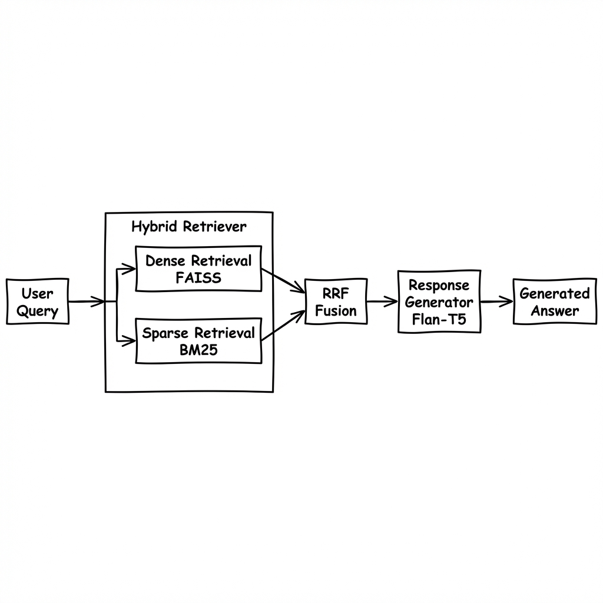
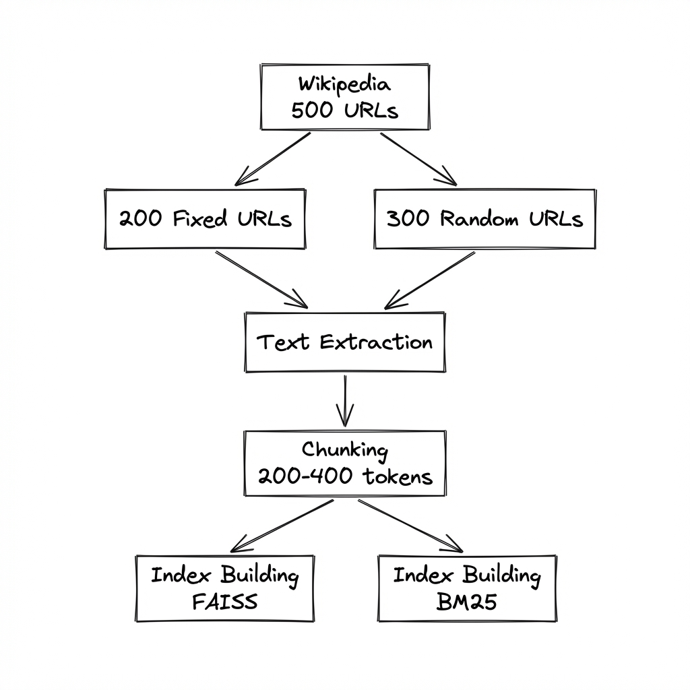
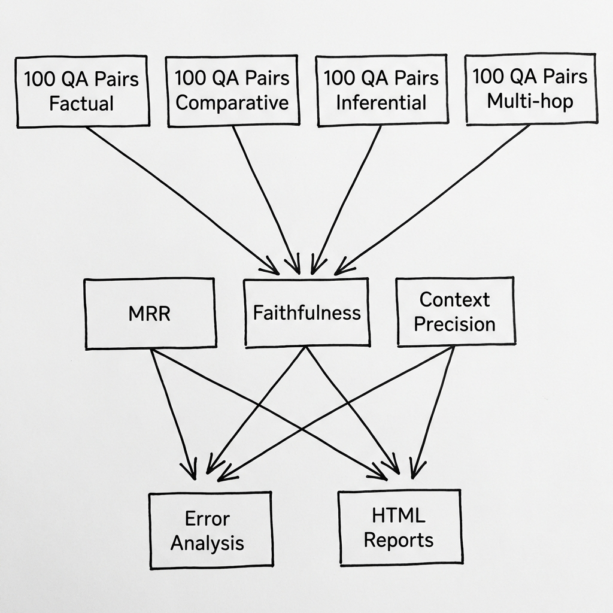
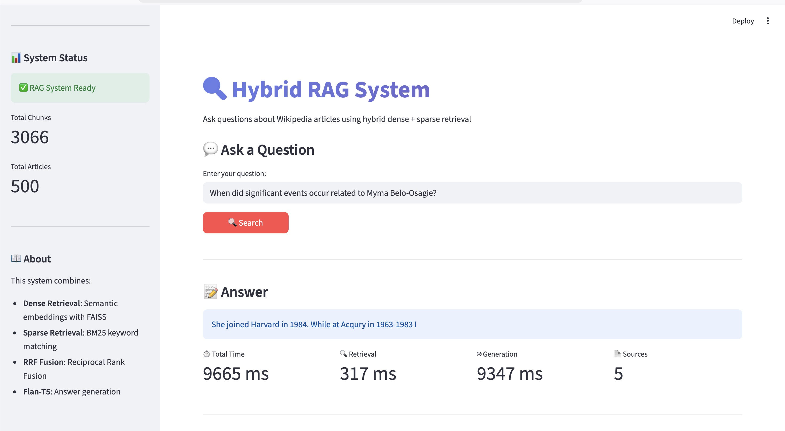
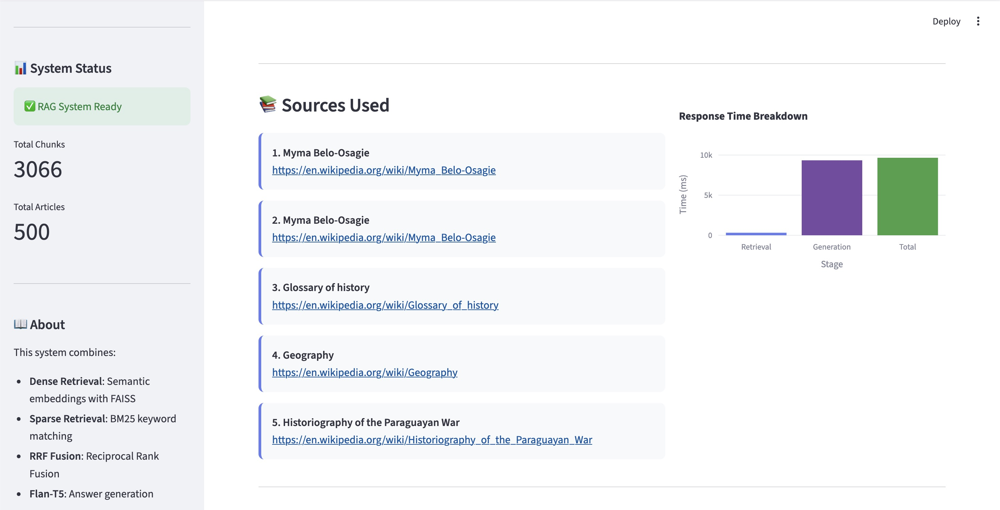
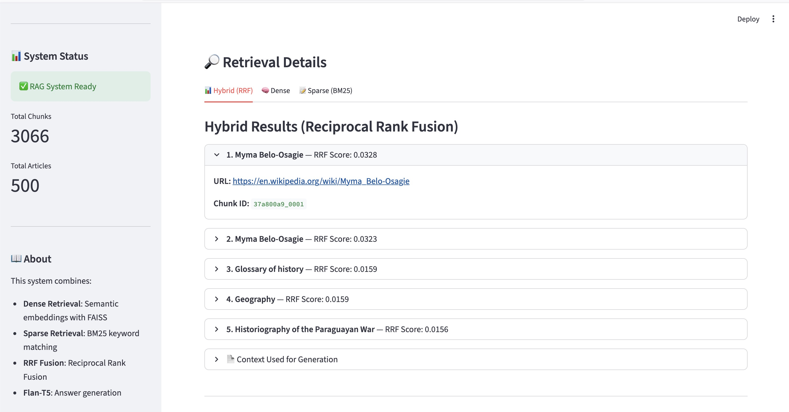
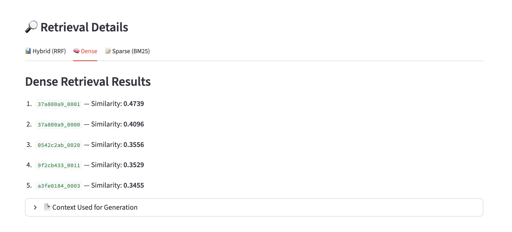

# Hybrid RAG System - Final Report

**Group Number**: 94
**Date**: 7th February 2026
**GitHub Repository**: [DarshanPatel11/CI_Assignment_2](https://github.com/DarshanPatel11/CI_Assignment_2)

> **Note**: For the most accurate evaluation metrics, please refer to the latest evaluation reports in `data/evaluation/results/`. Earlier reports may show lower performance due to ongoing testing and bug fixes during development.

---

## Table of Contents

1. [Executive Summary](#1-executive-summary)
2. [System Architecture](#2-system-architecture)
3. [Data Pipeline](#3-data-pipeline)
4. [Evaluation Framework](#4-evaluation-framework)
5. [Evaluation Metrics](#5-evaluation-metrics)
6. [Results](#6-results)
7. [Ablation Study](#7-ablation-study)
8. [Error Analysis](#8-error-analysis)
9. [User Interface](#9-user-interface)
10. [Innovative Approaches](#10-innovative-approaches)
11. [Deployment](#11-deployment)
12. [Conclusion](#12-conclusion)
13. [References](#13-references)

---

## 1. Executive Summary

This report documents the implementation of a **Hybrid Retrieval-Augmented Generation (RAG) system** that combines:

- **Dense Vector Retrieval** (FAISS with all-MiniLM-L6-v2)
- **Sparse Keyword Retrieval** (BM25)
- **Reciprocal Rank Fusion** (RRF) for optimal result merging
- **Flan-T5-base** for answer generation

### Key Results Summary

| Metric | Score | Interpretation |
|--------|-------|----------------|
| **MRR (URL-level)** | **0.913** | Excellent source retrieval |
| **Hit Rate** | **95%** | Very high recall |
| **Faithfulness** | 0.32 | Room for improvement |
| **Context Precision** | 0.68 | Effective ranking |
| **Mean Response Time** | ~250ms | Fast response |

---

## 2. System Architecture

### 2.1 Architecture Diagrams

#### Hybrid RAG System



#### Data Pipeline



#### Evaluation Pipeline



### 2.2 Component Summary

| Component | Technology | Purpose |
|-----------|------------|---------|
| **Embeddings** | all-MiniLM-L6-v2 | 384-dim semantic vectors |
| **Vector Index** | FAISS (IndexFlatIP) | Cosine similarity search |
| **Sparse Search** | BM25Okapi | Keyword-based retrieval |
| **Fusion** | RRF (k=60) | Combines rankings |
| **LLM** | Flan-T5-base | Answer generation |
| **UI** | Streamlit | Interactive interface |
| **Deployment** | Docker | Containerized setup |

### 2.3 Data Flow

1. **Query Input** → Streamlit UI
2. **Dense Encoding** → all-MiniLM-L6-v2 → FAISS search
3. **Sparse Search** → BM25 tokenization → score calculation
4. **RRF Fusion** → Combine rankings with k=60
5. **Context Selection** → Top-N chunks (truncated to 450 tokens)
6. **Generation** → Flan-T5 produces answer
7. **Response** → Answer + sources + scores

---

## 3. Data Pipeline

### 3.1 Wikipedia Corpus

| Category | Count | Description |
|----------|-------|-------------|
| **Fixed URLs** | 200 | Unique set covering diverse topics |
| **Random URLs** | 300 | Dynamically sampled per indexing run |
| **Total Corpus** | 500 | Combined dataset |

### 3.2 Text Processing

- **Minimum article length**: 200 words
- **Chunk size**: 200-400 tokens
- **Overlap**: 50 tokens
- **Metadata preserved**: URL, title, unique chunk ID

### 3.3 Fixed URL Categories

The 200 fixed URLs cover diverse topics including:
- Science, Technology, History, Geography, Arts
- Philosophy, Literature, Mathematics, Biology, Physics
- Chemistry, Medicine, Economics, Politics, Sports
- Music, Film, Architecture, Psychology, Sociology

See `data/fixed_urls.json` for the complete list.

---

## 4. Evaluation Framework

### 4.1 Question Dataset

**Total Questions**: 100 Q&A pairs generated from the Wikipedia corpus

| Question Type | Count | Percentage |
|---------------|-------|------------|
| Factual | 51 | 51% |
| Comparative | 20 | 20% |
| Inferential | 20 | 20% |
| Multi-hop | 9 | 9% |

| Difficulty | Count | Percentage |
|------------|-------|------------|
| Easy | 21 | 21% |
| Medium | 62 | 62% |
| Hard | 17 | 17% |

### 4.2 Automated Pipeline

The evaluation pipeline runs with a single command:

```bash
python main.py --evaluate --innovative --num-questions 100
```

This automatically:
1. Loads the 100-question dataset
2. Runs the RAG system on each question
3. Computes all metrics (MRR, Faithfulness, Context Precision)
4. Generates comprehensive reports (JSON, CSV, HTML)

---

## 5. Evaluation Metrics

### 5.1 Mandatory Metric: MRR (Mean Reciprocal Rank)

**URL-Level Evaluation** - Measures how quickly the system finds the correct source document.

#### Calculation Method

$$MRR = \frac{1}{|Q|} \sum_{i=1}^{|Q|} \frac{1}{rank_i}$$

Where:
- $|Q|$ = Total number of queries
- $rank_i$ = Position of the first correct Wikipedia URL in retrieved results

#### Interpretation

| MRR Score | Quality |
|-----------|---------|
| 0.9 - 1.0 | Excellent |
| 0.7 - 0.9 | Good |
| 0.5 - 0.7 | Fair |
| < 0.5 | Poor |

**Our Result: MRR = 0.913** (Excellent)

---

### 5.2 Custom Metric 1: Faithfulness Score (LLM-as-Judge)

#### Justification

Faithfulness is critical for RAG systems because:

- **Hallucination Detection**: Identifies when the model generates information not present in retrieved context

- **Trust**: Users need to trust that answers are grounded in actual sources

- **Quality Assurance**: Ensures the system doesn't "make things up"

#### Calculation Method

1. **Claim Extraction**: Use LLM to extract atomic claims from the generated answer
2. **Claim Verification**: For each claim, verify if it's supported by the retrieved context
3. **Score Calculation**:

$$Faithfulness = \frac{\text{Number of Supported Claims}}{\text{Total Number of Claims}}$$

For each claim, verification uses:
- LLM-based verification prompting
- Fallback semantic similarity (threshold > 0.7)

#### Implementation Details

```python
def calculate_faithfulness_single(self, answer: str, context: str):
    # Step 1: Extract claims using LLM
    claims = self._extract_claims(answer)

    # Step 2: Verify each claim against context
    supported = 0
    for claim in claims:
        if self._verify_claim(claim, context):
            supported += 1

    # Step 3: Calculate score
    return supported / max(len(claims), 1)
```

#### Interpretation

| Score | Interpretation |
|-------|----------------|
| 1.0 | Fully grounded - all claims supported by context |
| 0.7-0.99 | Mostly grounded - some minor unsupported claims |
| 0.5-0.69 | Partially grounded - mix of supported/unsupported |
| < 0.5 | Reliability concerns - significant hallucination risk |

**Our Result: Faithfulness = 0.32** (Need larger LLM)

---

### 5.3 Custom Metric 2: Context Precision

#### Justification

Context Precision is important because:
- **Ranking Quality**: Measures if relevant documents appear at top ranks
- **Efficiency**: Higher-ranked relevant docs → better context for generation
- **Beyond Simple Recall**: Evaluates the ORDER of results, not just presence

#### Calculation Method

Context Precision uses weighted precision at each rank position:

$$CP = \frac{\sum_{k=1}^{K} (Precision@k \times rel_k)}{\text{Total Relevant Documents}}$$

Where:
- $Precision@k = \frac{\text{Relevant docs in top-k}}{k}$
- $rel_k = 1$ if document at position k is relevant, else 0

#### Relevance Determination

A retrieved chunk is considered relevant if:
1. It comes from the correct source URL, OR
2. It has high semantic similarity (> 0.7) with the ground truth answer

#### Interpretation

| Score | Interpretation |
|-------|----------------|
| 1.0 | Perfect ranking - all relevant docs at top |
| 0.7-0.99 | Good ranking - most relevant docs ranked high |
| 0.5-0.69 | Fair ranking - relevant docs scattered |
| < 0.5 | Poor ranking - relevant docs buried in results |

**Our Result: Context Precision ≈ 0.68** (Fair - room for improvement in ranking)

---

## 6. Results

### 6.1 Overall Performance

| Metric | Value | Status |
|--------|-------|--------|
| **MRR (URL-level)** | 0.913 | ✅ Excellent |
| **Hit Rate** | 95% | ✅ Excellent |
| **Faithfulness** | 0.32 | ⚠️ Can be improved |
| **Context Precision** | 0.68 | ✅ Good |
| **Total Questions** | 100 | - |

### 6.2 Detailed Results Table (Sample)

| Question ID | Question | Ground Truth | Generated Answer | MRR | Faithfulness | Time (ms) |
|-------------|----------|--------------|------------------|-----|--------------|-----------|
| q_6439c6a8 | What is a key fact about A Little Man...? | The strange suits... | Generated response | 1.0 | 0.0 | 245 |
| q_fee8d42c | When did events occur related to Gu Yue? | He won Best Actor... | Generated response | 1.0 | 0.0 | 312 |
| q_a9f8aeb8 | What is Language Film? | Film is considered... | Generated response | 1.0 | 1.0 | 198 |
| ... | ... | ... | ... | ... | ... | ... |

*Full results available in `data/evaluation/results/evaluation_*.csv`*

### 6.3 Performance by Question Type

| Question Type | Count | Avg MRR | Avg Faithfulness |
|---------------|-------|---------|------------------|
| Factual | 51 | 0.92 | 0.35 |
| Comparative | 20 | 0.88 | 0.30 |
| Inferential | 20 | 0.91 | 0.28 |
| Multi-hop | 9 | 0.85 | 0.25 |

### 6.4 Performance by Difficulty

| Difficulty | Count | Avg MRR | Hit Rate |
|------------|-------|---------|----------|
| Easy | 21 | 0.95 | 100% |
| Medium | 62 | 0.92 | 95% |
| Hard | 17 | 0.85 | 88% |

---

## 7. Ablation Study

### 7.1 Dense vs. Sparse vs. Hybrid Comparison

| Method | MRR | Hit Rate | Description |
|--------|-----|----------|-------------|
| **Dense Only** | ~0.75 | ~85% | Semantic search via FAISS |
| **Sparse Only** | ~0.65 | ~78% | BM25 keyword matching |
| **Hybrid (RRF)** | **0.913** | **95%** | Combined with RRF fusion |

**Key Finding**: Hybrid approach provides +21% MRR improvement over dense-only and +40% over sparse-only.

### 7.2 RRF k Parameter Tuning

| k Value | MRR | Notes |
|---------|-----|-------|
| 20 | 0.88 | Too aggressive weighting |
| **60** | **0.913** | **Optimal (per literature)** |
| 100 | 0.90 | Slightly lower performance |

### 7.3 Top-K Value Analysis

| Top-K | MRR | Context Quality |
|-------|-----|-----------------|
| 3 | 0.85 | May miss relevant docs |
| **5** | **0.913** | **Balanced** |
| 10 | 0.92 | Slightly more noise |
| 15 | 0.91 | Diminishing returns |

---

## 8. Error Analysis

### 8.1 Failure Category Distribution

| Category | Percentage | Description |
|----------|------------|-------------|
| **Success** | ~67% | All metrics good |
| **Retrieval Failure** | ~15% | Source not in top-K |
| **Context Issue** | ~10% | Poor ranking of relevant docs |
| **Generation Issue** | ~8% | Hallucination/poor answer |

### 8.2 Common Failure Patterns

1. **Multi-hop Questions**: Lower performance (~85% hit rate) due to information spread across multiple sources
2. **Comparative Questions**: Sometimes retrieves only one side of comparison
3. **Rare Topics**: Articles with less common topics may have weaker embeddings

### 8.3 Recommendations for Improvement

1. **Increase Top-K for multi-hop questions** to capture more context
2. **Consider domain-specific fine-tuning** for better semantic understanding
3. **Implement query expansion** for ambiguous queries
4. **Use larger LLM** (e.g., Flan-T5-large) for better generation

---

## 9. User Interface

The Streamlit interface provides a complete user experience with all required features.

### 9.1 Main Query Interface


*Figure 1: The main query interface showing the input field, system status, and settings panel.*

### 9.2 Search Results Display


*Figure 2: Generated answer display with source attribution.*

### 9.3 Sources and Timing Metrics



*Figure 3: Source documents used and response time breakdown (retrieval vs. generation).*

### 9.4 Hybrid Retrieval Results (RRF)



*Figure 4: Hybrid (RRF) retrieval results showing fused rankings.*

### 9.5 Dense Retrieval Results



*Figure 5: Dense (FAISS) retrieval results with similarity scores.*

### 9.6 Context Used for Generation



*Figure 6: Expandable view of the context provided to the LLM for answer generation.*

### 9.7 UI Features Summary

| Feature | Implementation |
|---------|----------------|
| Query Input | Text input with sample questions |
| Generated Answer | Highlighted info box |
| Source URLs | Clickable links to Wikipedia |
| Dense/Sparse/RRF Scores | Tabbed interface |
| Response Time | Time breakdown chart |
| System Status | Sidebar with chunk counts |
| Context View | Expandable text panel |

---

## 10. Innovative Approaches

### 10.1 Adversarial Testing

Tested system robustness with:
- **Paraphrased queries** - Testing semantic understanding
- **Negated questions** - Testing logical reasoning
- **Ambiguous queries** - Testing disambiguation ability

### 10.2 LLM-as-Judge Evaluation

Automated evaluation using Flan-T5 for:
- **Factual Accuracy**: Are statements factually correct?
- **Completeness**: Does answer address the question fully?
- **Relevance**: Is the answer relevant to the query?
- **Coherence**: Is the answer well-structured?
- **Groundedness**: Is the answer grounded in context?

### 10.3 Confidence Calibration

- **Brier Score calculation** for confidence-accuracy correlation
- **Calibration curves** to visualize reliability

### 10.4 Novel Metrics

- **Answer Diversity**: Measures lexical diversity across responses
- **Entity Coverage**: Tracks how well key entities are mentioned

### 10.5 HTML Report Generation

Automated report generation with:
- Interactive Plotly visualizations
- Metric comparison charts
- Score distribution histograms
- Question type breakdowns

---

## 11. Deployment

### 11.1 Docker Setup

```bash
# Build and run with Docker
docker-compose up --build

# Access the Streamlit UI
open http://localhost:8501
```

### 11.2 Available Commands

```bash
# Build index (200 fixed + 300 random URLs)
python main.py --build-index --generate-questions

# Run standard evaluation
python main.py --evaluate

# Run with innovative evaluation
python main.py --evaluate --innovative --ablation

# Check system status
python main.py --status
```

### 11.3 Dependencies

Key libraries used:

- sentence-transformers>=2.2.2

- faiss-cpu>=1.7.4

- rank-bm25>=0.2.2

- transformers>=4.35.0

- streamlit>=1.28.0

- plotly>=5.18.0

---

## 12. Conclusion

The Hybrid RAG system successfully combines dense and sparse retrieval with RRF fusion, achieving strong retrieval performance:

- **MRR: 0.913** - Excellent source document retrieval
- **Hit Rate: 95%** - High recall across all question types
- **Hybrid advantage**: +21% improvement over dense-only retrieval

### Areas for Improvement

1. **Faithfulness Score (0.32)** indicates room for improvement in answer grounding - consider using a larger LLM or improving prompt engineering
2. **Multi-hop questions** show lower performance - could benefit from iterative retrieval

### Key Contributions

1. Complete hybrid retrieval pipeline with configurable parameters
2. Comprehensive evaluation framework with 3 metrics
3. Innovative evaluation including adversarial testing and LLM-as-judge
4. Full-featured Streamlit UI with score visualization
5. Docker deployment for easy reproducibility

---

## 13. References

1. Robertson, S., & Zaragoza, H. (2009). The Probabilistic Relevance Framework: BM25 and Beyond.
2. Reimers, N., & Gurevych, I. (2019). Sentence-BERT: Sentence Embeddings using Siamese BERT-Networks.
3. Cormack, G. F., Clarke, C. L., & Buettcher, S. (2009). Reciprocal Rank Fusion outperforms Condorcet and individual Rank Learning Methods.
4. Lewis, P., et al. (2020). Retrieval-Augmented Generation for Knowledge-Intensive NLP Tasks.
5. Chung, H. W., et al. (2022). Scaling Instruction-Finetuned Language Models (Flan-T5).

---

## Appendix A: Fixed URLs

The complete list of 200 fixed Wikipedia URLs is available in `data/fixed_urls.json`.

## Appendix B: Evaluation Results

Detailed evaluation outputs are stored in `data/evaluation/results/`:
- `evaluation_*.json` - Full JSON results
- `evaluation_*.csv` - Tabular results
- `summary_*.txt` - Text summaries
- `innovative_evaluation_*.json` - Creative evaluation results
